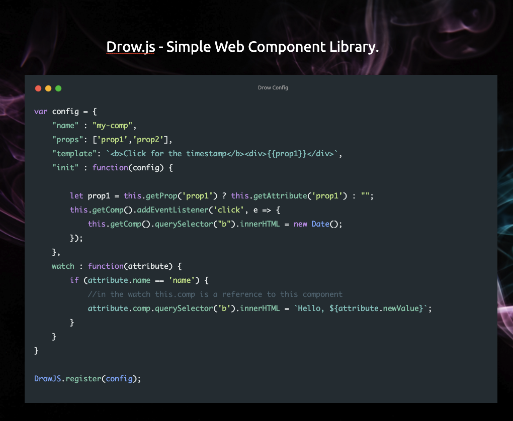

[](https://gitpod.io/#https://github.com/johnfacey/drowjs)

# Drow

Simple Web Component Library for creating custom HTML Components.
<div style="clear:both;padding-bottom:10px">
<p>

</p>
</div>

## Updates

Converted object references to Drow and drow internal elements instead of DrowJS
## Setup

Include the drow.js in an html file:

```
<script src="drow.js"></script>
```

Or as an NPM Module
```
import Drow from 'drow';
```

## Define a Drow Component

Define a Drow Object to setup a componet:

Component needs to have a <br />
- **name** : name of HTML Custom Component <br />
- **props** : properties set on the Custom Component <br />
- **template** : standard html template <br />
- **init** : function() - optional<br />
- **watch** : function(obj) - optional<br />
- **templating** : You can now use handlebars/mustache style variables in templates there are applied by prop name 
    Ex: {{prop1}}

HTML
```
<my-comp prop1="AAA" prop2="BBB"> </my-comp>
```
JavaScript 
```
var config = {
    "name" : "my-comp",
    "props": ['prop1','prop2'],
    "template": `<div>
                  <div>Every time you click on timestamp it will update the time.</div>
            <b>Click for the timestamp</b><div>{{prop1}}</div>
            </div>`,
    "init" : function(config) {
        let prop1 = this.getProp('prop1') ? this.getAttribute('prop1') : "";
        //in the init this.getComp() is used to obtain the component

      this.getComp().addEventListener('click', e => {
			this.getComp().querySelector("b").innerHTML = new Date();
		});
    },
    watch : function(attribute) {
        if (attribute.name == 'name') { //in the watch this.comp is a reference to this component
            attribute.comp.querySelector('b').innerHTML = `Hello, ${attribute.newValue}`;
        }
    }
}

DrowJS.register(config);

```

## Outline
```
//Define Component
<my-comp title="Great Name" link="https://something.com">
  <!-- 
    Web Components must be in primary-secondary name separated by dash ie my-comp 
    Componets and other HTML elements in the comp will be automatically added to the {{bind}} of the components template.
  -->
</my-comp>

//Template for Component
template = `<div>
  <div>Title: {{title}}</div>
  <div>Link: {{link}}</div>
</div>`

//Component Config
var myComp = {
    "name" : "my-comp",
    "props": ['title','link'],
    "template": template,
    "init" : function(config) {       //optional init    
    },
    watch : function(attribute) {    //optional watch -- hooks/useEffect
    }
}
//Register Component
DrowJS.register(myComp); //using the config created earlier
```

## Examples

Basic Example:

 [Example 1](src/index.html)


## Setup from npm

First install dependencies:

```
npm install
```

Run commands:
```
npm run server
```

## Credits

Author [johnfacey.dev](https://johnfacey.dev/)

Twitter [twitter.com/johnfacey](https://twitter.com/johnfacey)

